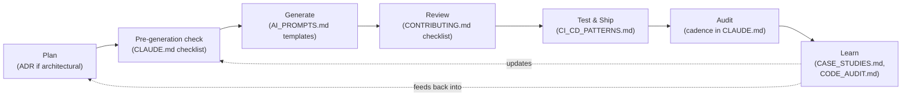

# AI Enterprise Scaffold

A starting point for building enterprise-grade software with heavy AI
assistance, without the specific failure mode that AI-assisted development
introduces: **context-reset drift** — the same helper reimplemented four
times, the same business rule encoded three slightly different ways, a
security guard nobody ever verified actually fires, because each
generating session had no memory of the sessions before it.

This is not a code framework. It doesn't install a package or scaffold an
app skeleton (`create-react-app`-style). It's a **discipline scaffold**: the
documents, structure, and process that keep an AI-assisted codebase
internally consistent as it grows past the size where any one person (or
any one AI session) can hold the whole thing in their head.

---

## What "AI Scaffolding" means

Construction scaffolding isn't the building — it's temporary structure
that lets people work safely and consistently *while* the building goes
up, then becomes largely invisible once the building can stand on its
own. AI scaffolding, in the sense this repo means it, is the same idea
applied to a codebase: a set of documents and habits that don't ship as
part of the product, but that every AI session (and every human) works
*inside of* while the product is being built.

Concretely, it's three things working together:

1. **A memory substitute.** An AI session has no memory of the last
   session. `CLAUDE.md` and the ADR log are the durable memory a human
   team would otherwise carry in their heads — read at the start of
   every session, not reconstructed from scratch each time.
2. **A pre-generation habit.** The checklist in `CLAUDE.md` runs
   *before* code is written, not after — it changes what a session
   optimizes for (search first, then generate) instead of trying to
   catch the result after the fact.
3. **A recurring, structural audit** that per-change review cannot do,
   because per-change review only ever sees one change at a time, and
   drift is only visible when the *whole* codebase is looked at at once.

None of this is unique to AI-written code — good engineering teams do
versions of all three already. What's different with AI assistance is
the *rate*: a human team accumulates this kind of drift over years; an
AI-assisted team can accumulate it in weeks, because generation is fast
and each session's context genuinely resets. The scaffolding exists to
make the discipline explicit and load-bearing, precisely because the
old, implicit version — "the team just remembers" — doesn't transfer to
a collaborator with no memory between sessions.

---

## The AI-assisted development lifecycle this scaffold assumes



Each stage maps to a real artifact in this repo, not an abstract idea:

1. **Plan.** Decide what to build. If it's a real architectural choice —
   not just a feature — write the ADR *before* or *alongside* building
   it, not after, while the reasoning is still fresh and the
   alternatives actually considered are still visible.
2. **Pre-generation check.** Before any code gets written, run
   `CLAUDE.md`'s checklist against the task: has this pattern been built
   before, does it touch a shared helper, does it belong on the security
   review trigger list.
3. **Generate.** Write the code — human or AI session. Start from an
   `AI_PROMPTS.md` template if the task fits an existing category,
   rather than a blank prompt that optimizes only for "make it work."
4. **Review.** PR review against `CONTRIBUTING.md`'s checklist. This is
   real, necessary, and — this is the important part — *not sufficient
   on its own*, because it only ever sees one change at a time.
5. **Test & ship.** The CI gate, then a release that actually proves the
   deployment works (`docs/CI_CD_PATTERNS.md`), not just that the build
   succeeded.
6. **Audit.** On a real, recurring cadence — not "whenever someone
   remembers" — a dedicated pass asks the question step 4 structurally
   cannot: does this whole subsystem, looked at all at once, still make
   sense. Findings go in `docs/CODE_AUDIT.md`.
7. **Learn.** When an audit (or an incident) finds real drift, write it
   up in `docs/CASE_STUDIES.md` — and feed what was learned back into
   `CLAUDE.md`'s checklist or invariants, so the *next* pass through this
   loop starts from a slightly better step 2 than the last one did. This
   is the step that makes the lifecycle a loop instead of a one-time
   setup: the scaffolding is supposed to get more specific and more
   useful over time, not stay in its initial, generic state.

---

## What's in here, and why

| File / folder | Purpose |
|---|---|
| [`CLAUDE.md`](CLAUDE.md) | The core artifact. Loaded automatically by Claude Code (and readable by any AI tool) at the start of every session — the pre-generation checklist, architecture invariants, drift-prevention framework, and audit cadence. **This is what actually prevents drift**, not the folder structure around it. |
| [`AI_PROMPTS.md`](AI_PROMPTS.md) | A growing library of reusable, project-specific prompt templates, so each new task starts from a prompt that already encodes "search for existing patterns first," not a blank page. |
| [`docs/architecture/decisions/`](docs/architecture/decisions/) | Architecture Decision Records (ADRs) — a permanent, append-only log of *why* each significant technical decision was made. The single best defense against an AI session "helpfully" reverting a decision it doesn't have the context for. |
| [`docs/CASE_STUDIES.md`](docs/CASE_STUDIES.md) | Empty until this project has its first real drift incident. Then: write down what broke, why ordinary review missed it, and what question finally surfaced it. A real case study from *this* project is worth more than any amount of generic advice — including everything in this README. |
| [`docs/CODE_AUDIT.md`](docs/CODE_AUDIT.md) | The living, dated ledger `CLAUDE.md`'s Audit Cadence writes into — every audit run, what it checked, what it found, what changed since last time. Explicitly not a certification; it's the evidence trail that the audits actually happen. |
| [`CONTRIBUTING.md`](CONTRIBUTING.md) | Process and engineering conventions — the PR checklist, commit conventions, testing standards. |
| [`docs/CI_CD_PATTERNS.md`](docs/CI_CD_PATTERNS.md) | Two CI/CD patterns worth adopting once there's real code: a test-suite gate, and a release pattern that includes an actual deployment smoke test — not just "build succeeded." Shown as copy-paste examples, not live workflow files, so a fresh clone doesn't show a failing check with nothing real to test yet. |

---

## What this scaffold is *for*

Three concrete things it gives a new project on day one, instead of
discovering the need for them the hard way after month three:

1. **A place for "why" to live that isn't a Slack thread.** ADRs mean the
   next session — human or AI — can find out *why* something unusual-looking
   was built that way, instead of "helpfully" simplifying it back to the
   naive version.
2. **A pre-generation habit, not a post-hoc cleanup habit.** The checklist
   in `CLAUDE.md` is meant to run *before* code is written, forcing a
   search-for-existing-patterns step that no AI session does by default —
   catching drift before it's committed, rather than auditing it out later.
3. **A named cadence for the audit that per-PR review structurally cannot
   do.** Individual PRs look correct in isolation. Drift is only visible at
   the whole-codebase level, asking "does this whole subsystem still make
   sense" — a question nobody is naturally prompted to ask unless a
   recurring audit exists whose entire job is asking it.

## What this scaffold is *not*

- Not a guarantee against bugs. It's a structural defense against a
  *specific* failure mode (cross-session inconsistency), not a substitute
  for testing, review, or judgment.
- Not a one-time setup you do and forget. `CLAUDE.md`'s checklist, the ADR
  discipline, and the audit cadence only work if they're actually used on
  every session, every PR, every quarter — a scaffold nobody follows
  provides exactly as much protection as no scaffold at all.
- Not opinionated about language, framework, or domain. Every concrete
  example in `CLAUDE.md` is a placeholder — `[bracketed]` — meant to be
  replaced with this project's real stack and real conventions the first
  week, not left generic.

---

## How to start a new project from this scaffold

```bash
# 1. Clone this repo under a new name
git clone https://github.com/<your-username>/ai-enterprise-scaffold.git my-new-project
cd my-new-project

# 2. Point it at a new, empty remote (don't push to this scaffold's history)
git remote remove origin
git remote add origin https://github.com/<your-username>/my-new-project.git

# 3. Start a clean history — you want your new project's own commit log,
#    not this scaffold's
rm -rf .git
git init
git add -A
git commit -m "Initial commit from ai-enterprise-scaffold"
git branch -M main
git push -u origin main
```

Then, **before writing any application code**:

1. Open `CLAUDE.md` and replace every `[bracketed]` placeholder — project
   name, stack, layer rules, naming conventions, shared-helper locations
   (empty for now; you'll fill this in as the first few helpers get
   written), security-review-trigger file list (also starts empty).
2. Delete this README's content and replace it with your actual project's
   README — this file's job was to explain the scaffold, not describe your
   product.
3. Write ADR-0001 recording the decision to start from this scaffold and
   why (a real ADR template is already in
   `docs/architecture/decisions/template.md`) — this is also a good forcing
   function to confirm you've actually read `CLAUDE.md` before writing
   anything else.
4. Put the first Audit Cadence run (`CLAUDE.md` → Audit Cadence) on an
   actual calendar or milestone trigger now, while it's easy to commit to
   — not after the codebase is already big enough that skipping it feels
   tempting. `docs/CODE_AUDIT.md` is where each run's findings get
   recorded, permanently, starting with the first one.
5. If using Claude Code specifically: `CLAUDE.md` at the repo root is
   picked up automatically, every session, with no further setup.

## Keeping the scaffold current as the project grows

- Every time a genuinely shared helper gets written, add it to `CLAUDE.md`'s
  Shared Helpers section immediately — not "later," since "later" is how
  the first duplicate gets written.
- The first time something breaks *because* an AI session couldn't see
  prior context, write it up in `docs/CASE_STUDIES.md`. Don't wait for a
  second one to feel like it's worth documenting — the case study is more
  valuable the closer it is to when institutional memory of it is still
  fresh.
- Actually run the audit cadence in `CLAUDE.md`. Put it on a real calendar
  or a real milestone trigger, not "whenever someone remembers."

---

## License

This scaffold is [MIT licensed](LICENSE) — use it, fork it, modify it,
build a company on top of it, no attribution required (though appreciated).

For your new project: MIT is a reasonable default if you want maximum
reuse with minimal friction, but it's your project's own choice, not
inherited automatically from this scaffold. Replace [`LICENSE`](LICENSE)
with whatever fits — MIT, Apache 2.0, a proprietary license, or
something else — once you've cloned it.
